# Student Management

Ứng dụng quản lý học sinh sinh viên.

## 1. Thành viên thực hiện

  
Thông tin chi tiết các thành viên

| STT | MSSV     | Họ và tên                                                  | Lớp      |
| --- | -------- | ---------------------------------------------------------- | -------- |
| 0   | 19522424 | [Lê Hữu Trung](https://github.com/lehuutrung1412)          | KHTN2019 |
| 1   | 19520354 | [Ngô Quang Vinh](https://github.com/vinhqngo5)             | KHTN2019 |
| 2   | 19521300 | [Nguyễn Đỗ Mạnh Cường](https://github.com/cuongnguyen1402) | KHTN2019 |
| 3   | 19521178 | [Nguyễn Đình Bình An](https://github.com/19521178)         | KHTN2019 |
| 4   | 19520257 | [Hứa Thanh Tân](https://github.com/htthtt12t1)             | KHTN2019 |

## 2. Mục đích xây dựng ứng dụng và khảo sát nhu cầu

  
Mục đích xây dựng ứng dụng

- Xây dựng một nền tảng tất cả trong một. Người quản trị, giáo viên, sinh viên có thể sử dụng công cụ để học tập trực tuyến, tra cứu kết quả học tập, đăng ký học phần, quản trị đào tạo, ...
- Nâng cao tính chính xác, bảo mật trong quản lý thông tin sinh viên.
- Thay thế các ứng dụng quản lý đã lỗi thời.
- Giao diện, luồng xử lý phù hợp hơn với nhu cầu của người sử dụng.

  
Khảo sát nhu cầu

- Nhu cầu của quản trị viên

  - Quản lý đào tạo bao gồm: lớp môn học, khoa - hệ đào tạo, môn học.
  - Quản lý danh sách sinh viên, giáo viên, quản trị viên.
  - Thêm thông báo đến từng đối tượng trong hệ thống.
  - Tạo đợt đăng ký học phần.
  - Thêm các trường thông tin mới cho sinh viên, giáo viên.
  - Tính bảo mật thông tin cao.

- Nhu cầu của giáo viên
  | 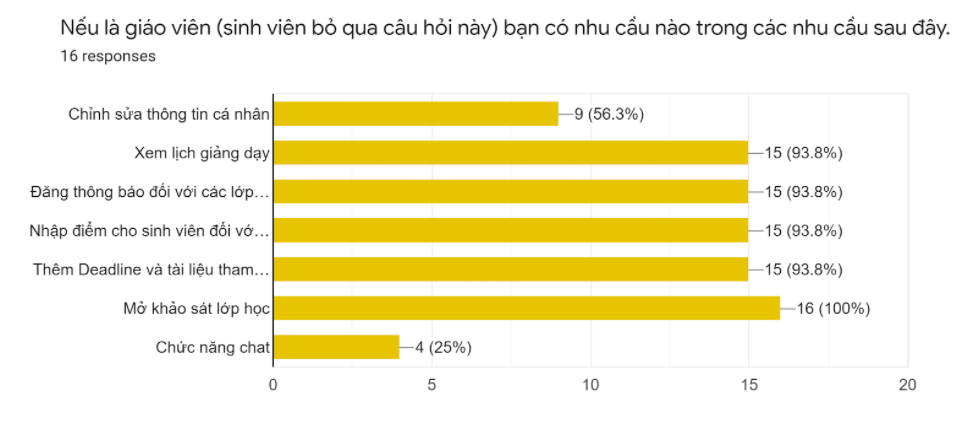 |
  |:--:|
  | _Nhu cầu sử dụng ứng dụng của giáo viên_ |

  - Chỉnh sửa, cập nhật thông tin cá nhân.
  - Xem lịch, thời khóa biểu giảng dạy.
  - Đăng thông báo các lớp đang giảng dạy.
  - Thêm điểm cho sinh viên.
  - Thêm deadline và tài liệu tham khảo.
  - Mở khảo sát lớp học.
  - Chức năng nhắn tin trong lớp học.

- Nhu cầu của sinh viên
  |  |
  |:--:|
  | _Nhu cầu sử dụng ứng dụng của sinh viên_ |

  - Chỉnh sửa, cập nhật thông tin cá nhân.
  - Xem lớp môn học đã và đang học.
  - Xem thời khóa biểu, lịch thi.
  - Xem kết quả học tập, điểm rèn luyện.
  - Đăng ký học phần.
  - Xem thông báo, xem tài liệu lớp học

  

## 3. Yêu cầu chức năng chi tiết

  
Quản lý lớp môn học

- Hiển thị thông tin lớp môn học: môn học, mã môn, sĩ số, giáo viên, thời khóa biểu, …
- Tìm kiếm các lớp môn học theo mã lớp, giáo viên giảng dạy.
- Thêm, sửa, xóa các lớp môn học.
- Hiển thị các lớp môn học theo quyền, theo học kỳ.
- Đi đến trang thông tin chi tiết của lớp môn học.

  
Quản lý chi tiết lớp môn học

  
- Bảng tin lớp học
  - Thêm, sửa, xóa bài đăng.
  - Tạo thông báo khi đăng bài.
  - Đăng bài kèm hình ảnh.
  - Thêm, sửa, xóa bình luận của bài đăng.
  - Tạo thông báo khi bình luận bài đăng.
- Lịch học, báo nghỉ, báo bù
  - Xem lịch học, lịch nghỉ, lịch bù.
  - Thêm ngày nghỉ học, ngày học bù.
  - Xóa ngày nghỉ học, ngày học bù.
  - Tạo thông báo khi báo nghỉ, báo bù.
- Tài liệu lớp học:
  - Thêm, sửa, xóa thư mục.
  - Thêm, sửa, xóa tài liệu.
  - Tải tài liệu.
  - Tải toàn bộ tài liệu lớp học.
  - Tra cứu tài liệu lớp học.
- Danh sách sinh viên lớp học
  - Xem tổng quan, thống kê điểm số sinh viên trong lớp.
  - Xem thông tin sinh viên trong lớp.
  - Thêm sinh viên vào lớp.
  - Xóa sinh viên ra khỏi lớp.
  - Tra cứu sinh viên trong lớp.
  - Thêm, sửa, xóa điểm thành phần cho lớp học.
  - Thêm, sửa, xóa điểm cho sinh viên trong lớp.

  
Quản lý khoa - hệ đào tạo

- Hiển thị thông tin, số lượng sinh viên ứng với từng khoa.
- Hiển thị thông tin, số lượng sinh viên ứng với từng hệ đào tạo.
- Thêm, sửa, xóa khoa.
- Thêm, sửa, xóa hệ đào tạo.
- Tìm kiếm khoa theo tên khoa hoặc theo tên hệ đào tạo mà khoa có.
- Thêm hệ đào tạo tương ứng với khoa.

  
Quản lý môn học

- Hiển thị danh sách và thông tin các môn học : tên môn, mã môn, số tín chỉ, mô tả, …
- Tìm kiếm môn học theo mã môn, tên môn.
- Thêm, sửa, xóa môn học.
- Thêm môn học từ excel.

  
Quản lý đăng ký học phần

  
- Quản trị viên
  - Thêm học kỳ và đóng mở học kỳ.
  - Thêm lớp môn học thủ công hoặc thêm từ file excel.
  - Xem chi tiết, sửa, xóa lớp môn học.
  - Tìm kiếm lớp môn học theo tên môn học, mã lớp học.
- Sinh viên
  - Đăng ký, hủy đăng ký lớp môn học.
  - Trực quan hóa các lớp môn học bằng thời khóa biểu.
  - Đánh dấu những lớp bị trùng giờ học.
  - Tìm kiếm lớp môn học chưa đăng ký theo tên môn học, mã lớp học.

  
Quản lý thời khóa biểu

  
- Hiển thị danh sách các lớp môn học dưới dạng bảng thời khóa biểu.
- Hiển thị các lớp môn học theo quyền (giáo viên, sinh viên), theo học kỳ.

  
Quản lý Thông báo

  
  - Quản trị viên:
    - Thêm, xóa, sửa, xem chi tiết thông báo thông báo.
    - Thêm thông báo nghỉ, thông báo bù
    - Tìm kiếm thông báo theo chủ đề, thời gian, loại thông báo

- Giáo viên:

  - Xem chi tiết thông báo thông báo. - Thêm thông báo nghỉ, thông báo bù
  - Tìm kiếm thông báo theo chủ đề, thời gian, loại thông báo

- Sinh viên:
  - Xem chi tiết thông báo thông báo.
  - Tìm kiếm thông báo theo chủ đề, thời gian, loại thông báo

  
Quản lý Thông tin cá nhân

- Hiển thị thông tin cá nhân của người dùng
- Chỉnh sửa thông tin cá nhân theo quyền

  
Quản lý cài đặt Thông tin cá nhân (Quản trị viên)

- HIển thị các trường thông tin cá nhân theo role
- Thêm, xóa , sửa, ẩn, xem các cài đặt của trường thông tin theo role

  
Quản lý người dùng (Quản trị viên)

- Thiết lập, cung cấp tài khoản và mật khẩu cho người dùng (sinh viên, giáo viên, Quản trị viên).
- Thêm người dùng thủ công và từ file.
- Chỉnh sửa, cập nhật thông tin cho người dùng.
- Tìm kiếm thông tin người dùng.

  
Quản lý điểm (sinh viên)

- Xem bảng điểm sinh viên.
- Xuất bảng điểm sinh viên (future work)

## 4. Công nghệ sử dụng

  
Các công nghệ sử dụng

- Nền tảng: .Net FrameWork, version 4.7.2
- Frontend: C#, XAML, Windows Presentation Foundation (WPF)
- Backend: C#
- ORM FrameWork: ADO.NET Entity FrameWork, version 6.0.0
- Hệ quản trị cơ sở dữ liệu: SQL Server
- Dịch vụ lưu trữ đám mây: Google Cloud Platform, CDN
- IDE: Microsoft Visual Studio 2019
- UI design tool: Miro
- Thư viện hỗ trợ khác: MaterialDesignXAML, System.Windows.Interactivity.WPF, Math Converter

## 5. Hướng dẫn cài đặt

  
Hướng dẫn cài đặt phần mềm Stuman từ mã nguồn

- Download hoặc clone repo về máy tính.
- Chạy file `SqlServer/data.sql`
- Chạy file `StudentManagement/StudentManagement/StudentManagement.sln` bằng Visual Studio
- Tài khoản mặc định:
  - Tài khoản admin: admin/admin
  - Tài khoản giáo viên: gv/gv
  - Tài khoản sinh viên: sv/sv

  
Hướng dẫn cài đặt phần mềm Stuman bản release

  
- Download file zip tại mục release.
- Giải nén file zip và bật kết nối mạng để sử dụng.
- Tài khoản mặc định: 
	- Tài khoản admin: admin/admin
	- Tài khoản giáo viên: gv/gv
	- Tài khoản sinh viên: sv/sv

## 6. Hướng dẫn sử dụng

  
Đăng nhập và quên mật khẩu

|  | 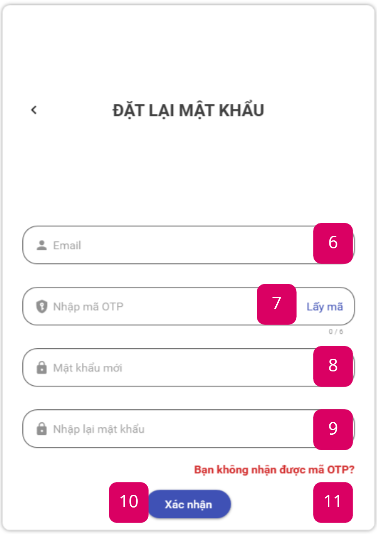 |
| :---------------------------: | :------------------------------------: |
|     _Màn hình đăng nhập_      |        _Màn hình quên mật khẩu_        |

1. Nhập tên đăng nhập - textbox
2. Nhập mật khẩu - passwordbox
3. Ghi nhớ đăng nhập - checkbox
4. Đăng nhập - button
5. Chuyển sang màn hình quên mật khẩu - button
6. Nhập Email để xác thực danh tính - textbox
7. Nhập mã OTP được gửi về Email - textbox and button
8. Nhập mật khẩu mới - passwordbox
9. Nhập lại mật khẩu mới - passwordbox

  
Màn hình lớp môn học

| 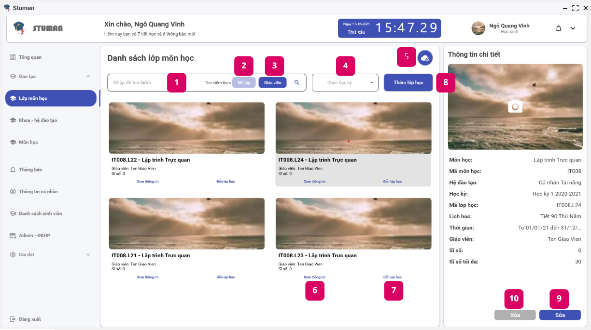 | 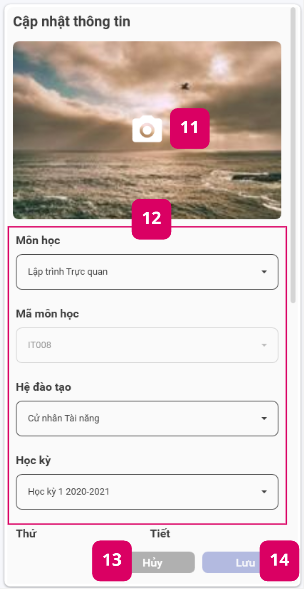 |
| :----------------------------------: | :--------------------------------------: |
|      _Màn hình quản lý lớp học_      |  _Màn hình chỉnh sửa thông tin lớp học_  |

1. Tìm kiếm lớp môn học - textbox
2. Chọn để tìm kiếm lớp môn học theo mã lớp và tên môn - button
3. Chọn để tìm kiếm lớp môn học theo giáo viên - button
4. Chọn học kỳ cần lọc - combobox
5. Đồng bộ với dữ liệu mới trên cloud - button
6. Xem thông tin lớp môn học - button
7. Đến trang thông tin chi tiết lớp học - button
8. Thêm lớp học mới - button
9. Đến giao diện chỉnh sửa lớp học - button
10. Xóa lớp học - button
11. Thay đổi ảnh bìa cho lớp học - button
12. Thay đổi thông tin cho lớp học - textbox, datepicker, combobox
13. Hủy tất cả thay đổi - button
14. Xác nhận thay đổi - button

  
Màn hình chi tiết lớp học - Bảng tin lớp học

|      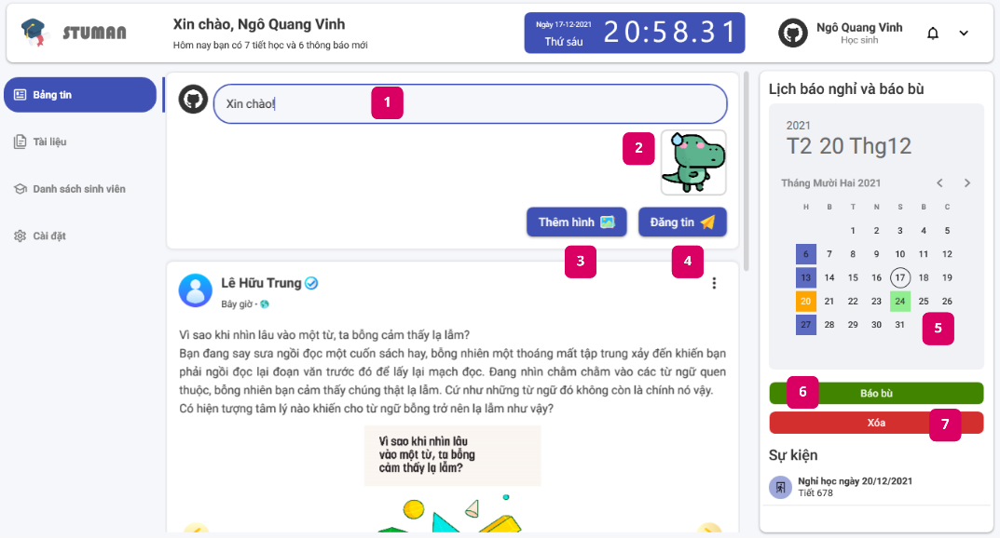       |
| :-----------------------------------------: |
| _Chức năng đăng bài viết mới trong lớp học_ |

|              |
| :------------------------------------------: |
| _Chức năng chỉnh sửa bài viết trong lớp học_ |

|       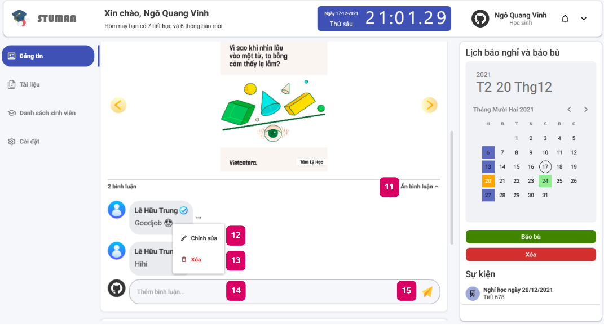       |
| :------------------------------------------: |
| _Chức năng bình luận bài viết trong lớp học_ |

  
Màn hình chi tiết lớp học - Tài liệu lớp học

|    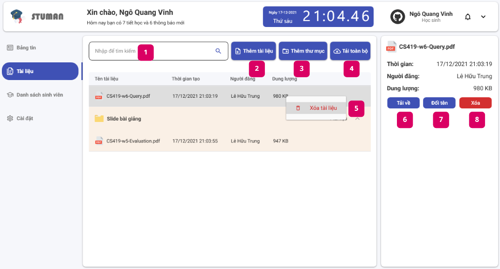     |
| :-----------------------------------------: |
| _Chức năng thêm sửa xóa file trong lớp học_ |

|     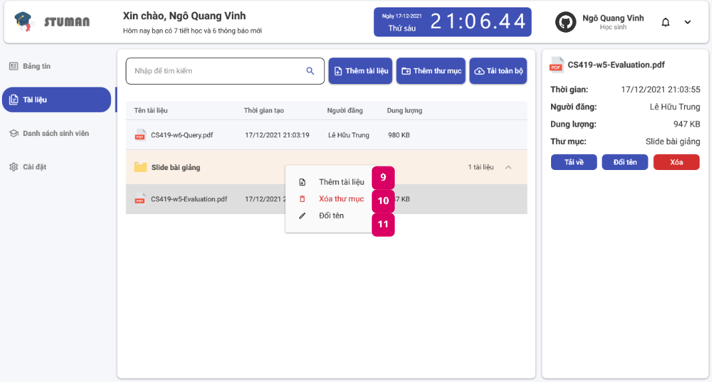      |
| :-------------------------------------------: |
| _Chức năng thêm sửa xóa folder trong lớp học_ |

  
Màn hình chi tiết lớp học - Cài đặt lớp học

| 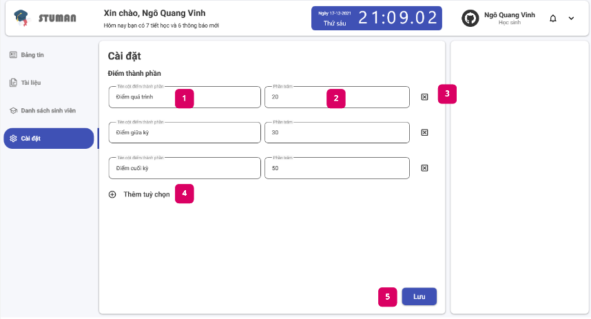 |
| :-----------------------------------------: |
|         _Màn hình cài đặt lớp học_          |

  
Màn hình chi tiết lớp học - Danh sách sinh viên lớp học

| 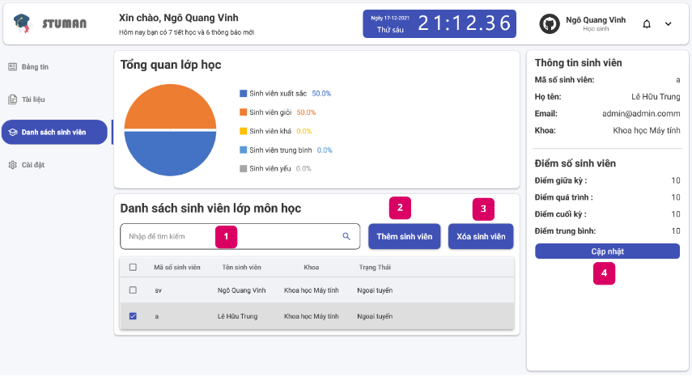 |  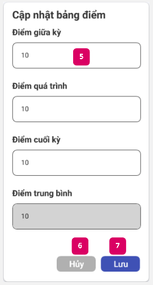  |
| :-----------------------------------------: | :-----------------------------------------------: |
|   _Màn hình danh sách sinh viên lớp học_    | _Màn hình chỉnh sửa thông tin học phần sinh viên_ |

  
Màn hình khoa - hệ đào tạo

| 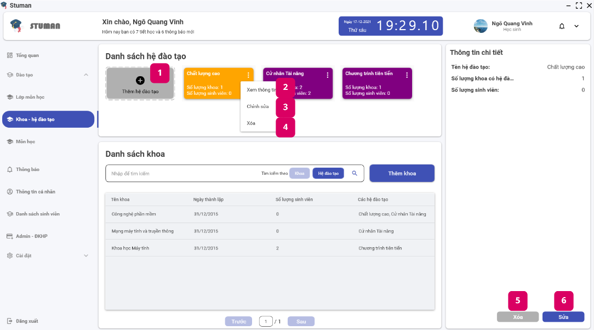 | 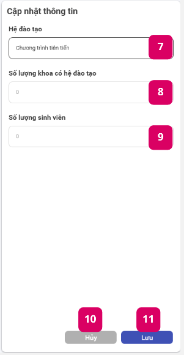  |
| :----------------------------------: | :---------------------------------------: |
|    _Màn hình quản lý hệ đào tạo_     | _Màn hình chỉnh sửa thông tin hệ đào tạo_ |

1. Thêm hệ đào tạo mới - button
2. Xem thông tin hệ đào tạo - button
3. Chỉnh sửa thông tin hệ đào tạo - button
4. Xóa hệ đào tạo - button
5. Xóa hệ đào tạo - button
6. Chỉnh sửa thông tin hệ đào tạo - button
7. Nhập tên hệ đào tạo - textbox
8. Số lượng khoa có hệ đào tạo (ứng dụng tự tính toán) - textbox
9. Số lượng sinh viên thuộc hệ đào tạo (ứng dụng tự tính toán) - textbox
10. Hủy bỏ các thay đổi hiện tại - button
11. Xác nhận các thay đổi hiện tại - button

| 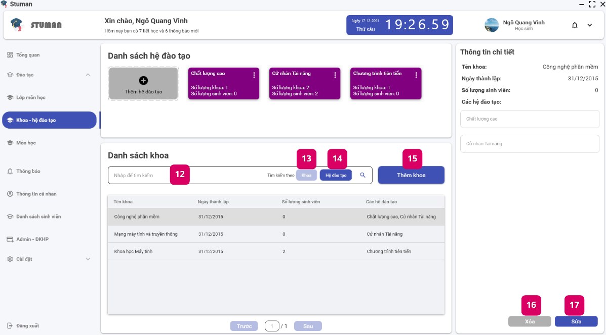 |    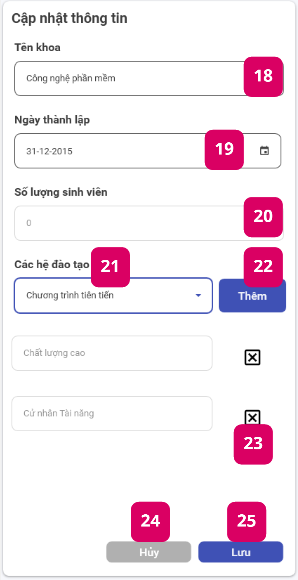    |
| :-----------------------------: | :---------------------------------------: |
|  _Màn hình quản lý hệ đào tạo_  | _Màn hình chỉnh sửa thông tin hệ đào tạo_ |

12. Tìm kiếm khoa - textbox
13. Tìm kiếm khoa theo tên khoa - button
14. Tìm kiếm khoa theo hệ đào tạo - button
15. Thêm khoa mới - button
16. Xóa khoa - button
17. Chỉnh sửa thông tin khoa - button
18. Nhập tên khoa - textbox
19. Chọn ngày thành lập khoa - datepicker
20. Số lượng sinh viên thuộc khoa (ứng dụng tự tính toán) - textbox
21. Các hệ đào tạo mà khoa chưa có - combobox
22. Thêm hệ đào tạo mới cho khoa - button
23. Xóa hệ đào tạo thuộc khoa - button
24. Hủy bỏ các thay đổi hiện tại - button
25. Xác nhận các thay đổi hiện tại - button

  
Màn hình môn học

| 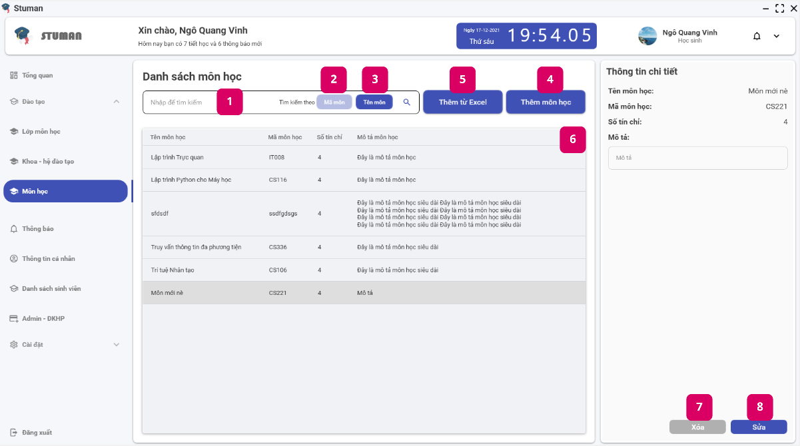 |  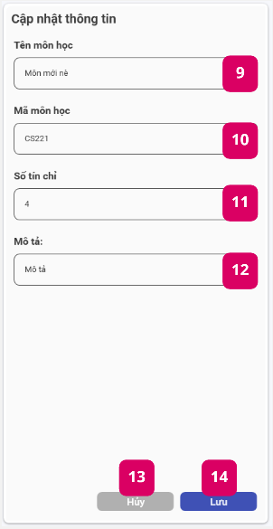   |
| :-----------------------------: | :------------------------------------: |
|   _Màn hình quản lý môn học_    | _Màn hình chỉnh sửa thông tin môn học_ |

1. Tìm kiếm môn học - textbox
2. Tìm kiếm môn học theo mã môn - textbox
3. Tìm kiếm môn học theo tên môn - textbox
4. Thêm môn học mới - button
5. Thêm môn học mới từ excel- button
6. Hiển thị danh sách môn học - datagrid
7. Chỉnh sửa thông tin môn học - button
8. Xóa môn học - button
9. Nhập tên môn học - textbox
10. Nhập mã môn học - textbox
11. Nhập số tín chỉ của môn học - textbox
12. Nhập mô tả môn học - textbox
13. Hủy bỏ các thay đổi hiện tại - button
14. Xác nhận các thay đổi hiện tại - button

  
  
Màn hình quản lý thông báo

| 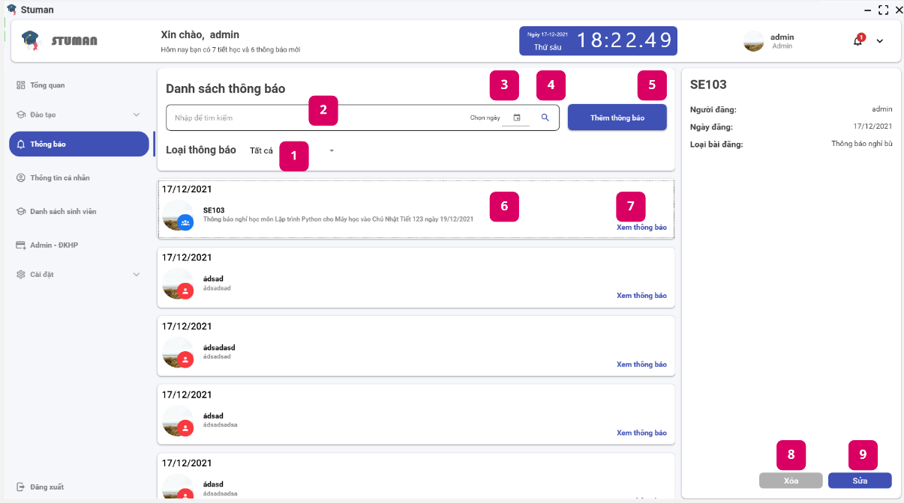 | 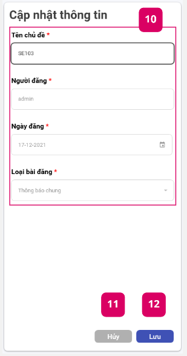 |
| :----------------------------------: | :--------------------------------------: |
|     _Màn hình quản lý thông báo_     |      _Màn hình chỉnh sửa thông báo_      |

1. Tìm kiếm theo loại thông báo - combobox
2. Nhập chủ đề theo chủ đề - textbox
3. Nhập ngày tìm kiếm - datepicker
4. Tìm kiếm theo chủ đề, ngày, loại thông báo - button
5. Thêm thông báo - button
6. Xem thông báo bên right side bar - button
7. Xem chi tiết thông báo trong dialog host - button
8. Xoá thông báo - button
9. Sửa thông báo - button
10. Thay đổi thông tin cho thông báo - textbox, textbox, datepicker, combobox
11. Huỷ sửa thông báo - button
12. Lưu cập nhật - button

|  | 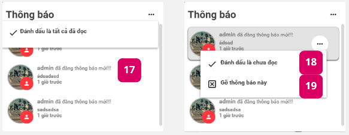 |
| :----------------------------------------: | :------------------------------------------: |
|          _Màn hình tạo thông báo_          |          _Popup box xem thông báo_           |

13. Nhập thông tin thông bao - textbox, combobox, datepicker
14. Thêm thông báo - button
15. Huỷ thêm thông báo - button
16. Đánh dấu tất cả đã đọc - button
17. Xem chi tiết thông báo - button
18. Đánh dấu đã đọc - button
19. Đánh dấu chưa đọc - button

  
Màn hình thông tin cá nhân

|   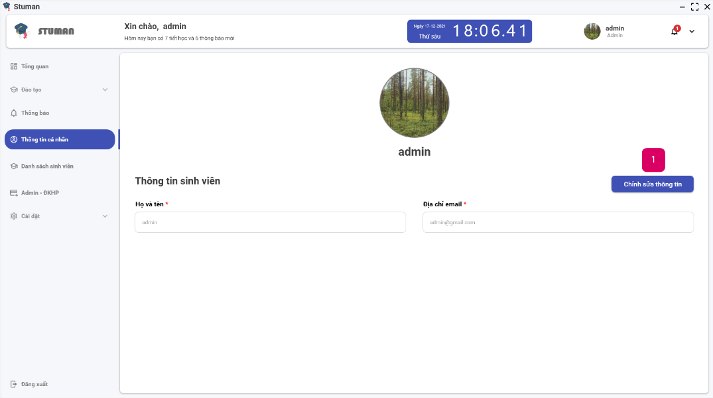   |  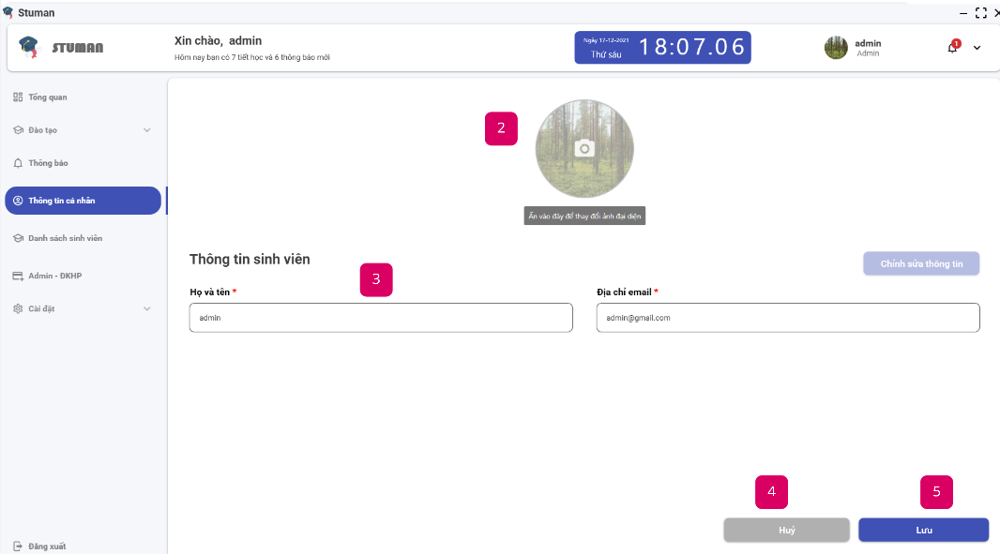  |
| :----------------------------------: | :------------------------------------: |
| _Màn hình quản lý thông tin cá nhân_ | _Màn hình chỉnh sửa thông tin cá nhân_ |

1. Chỉnh sửa thông tin cá nhân - button
2. Thay đổi ảnh đại diện - button
3. Thêm đổi thông tin - textbox, combobox, datepicker
4. Huỷ thay đổi thông tin - button
5. Lưu thông tin thay đổi - button

  
Màn hình cài đặt thông tin cá nhân

| 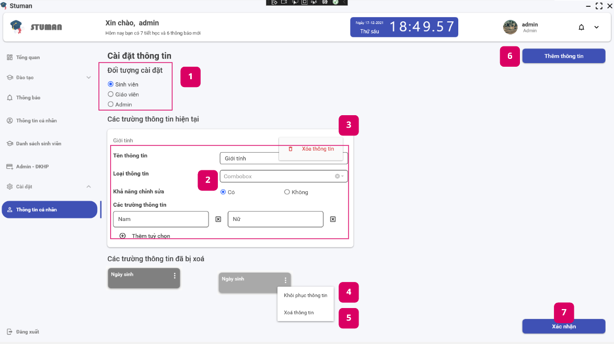 | 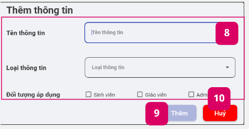 |
| :-------------------------------------: | :-------------------------------------------: |
|  _Màn hình cài đặt thông tin cá nhân_   |    _Cửa sổ thêm trường thông tin cá nhân_     |

1. Chọn role cài đặt - radio button
2. Thay đổi thiết lập trường thông tin - textbox, combobox, radio button, button
3. Xoá trường thông tin - button
4. Xoá vĩnh viễn trường thông tin - button
5. Khôi phục trường thông tin - button
6. Thêm trường thông tin - button
7. Xác nhận cài đặt - button
8. Nhập trường thông tin - textbox, combobox, checkbox
9. Thêm trường thông tin - button
10. Huỷ trường thông tin - button

  
Màn hình thời khóa biểu

| 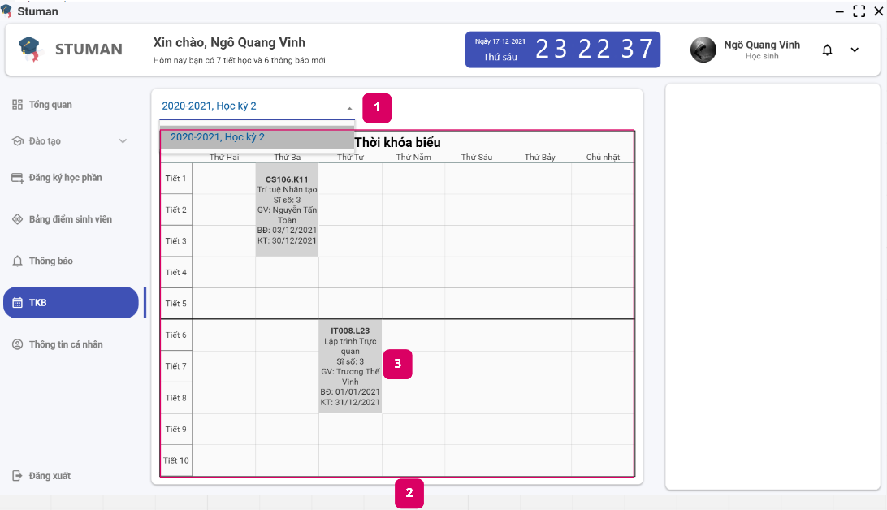   |
| :-------------------------------------: |
|  _Màn hình thời khóa biểu_              |

1. Chọn học kỳ - combobox
2. Khuôn thời khóa biểu - textblock, label
3. Đại diện lớp môn học - textblock

  
Màn hình đăng ký học phần ở sinh viên

| 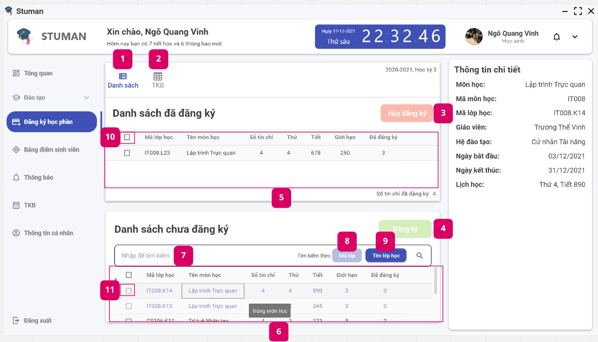 |
| :-------------------------------------: |
|  _Màn hình đăng ký học phần khi chọn danh sách_  |

| 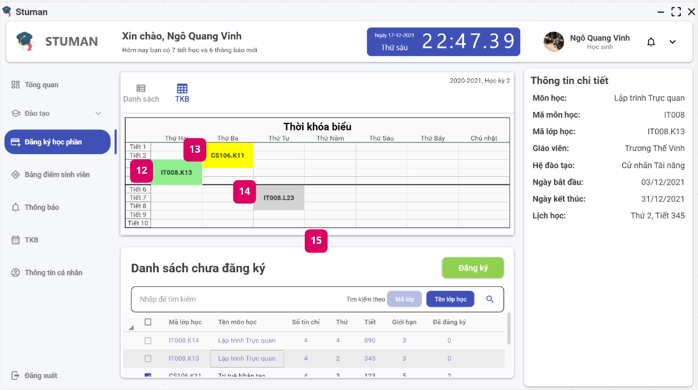 |
| :-------------------------------------: |
|  _Màn hình đăng ký học phần khi chọn TKB_  |

1. Chọn hiển thị các lớp đã đăng ký dưới dạng danh sách - tag
2. Chọn hiển thị các lớp đã đăng ký dưới dạng thời khóa biểu - tag
3. Hủy đăng ký các lớp được check - button
4. Đăng ký các lớp được check - button
5. Biểu diễn danh sách các lớp đã đăng ký - datagrid
6. Biểu diễn danh sách các lớp chưa đăng ký - datagrid
7. Nhập tên môn hoặc mã lớp để lọc danh sách các lớp chưa đăng ký - textbox
8. Chọn lọc theo tên môn học - button
9. Chọn lọc theo mã lớp học - button
10. Check tất cả lớp học của datagrid tương ứng - checkbox
11. Đưa lớp môn học vào danh sách chuẩn bị đăng ký hoặc chuẩn bị hủy đăng ký - checkbox
12. Đại diện cho lớp đang chọn - textblock
13. Đại diện cho lớp đã check - textblock
14. Đại diện cho lớp đã đăng ký - textblock
15. Khuôn cho thời khóa biểu các lớp đã đăng ký - textblock, label

  
Màn hình quản lí học phần của admin

| 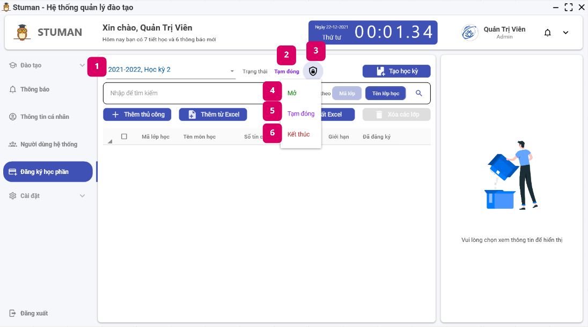   |
| :-------------------------------------: |
|  _Màn hình quản lí học phần ban đầu_            |

| 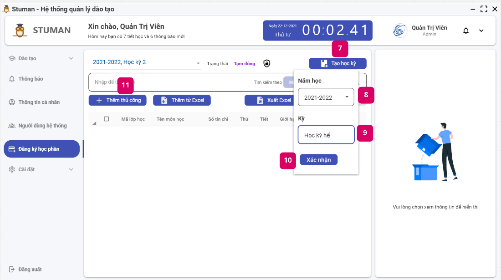   |
| :-------------------------------------: |
|  _Màn hình tạo học kỳ_            |

| 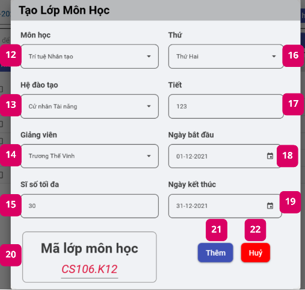   |
| :-------------------------------------: |
|  _Màn hình tạo thủ công lớp môn học_            |

|   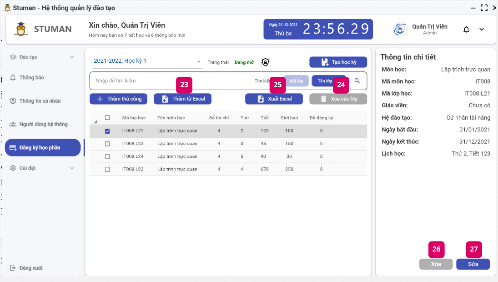   |  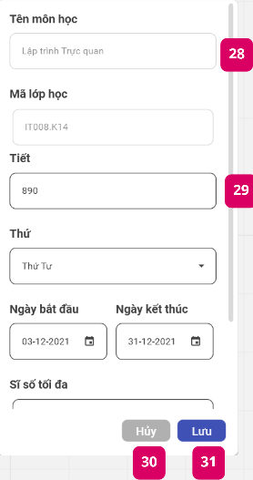  |
| :----------------------------------: | :------------------------------------: |
| _Màn hình quản lý học phần_ | _Màn hình chỉnh sửa thông tin lớp môn học_ |

1. Chọn học kỳ - combobox
2. Trạng thái đăng ký học phần của học kỳ được chọn - textblock
3. Hiện popup các trạng thái đăng ký học phần muốn sửa thành - button
4. Mở đăng ký học phần - button
5. Tạm đóng (hoặc chưa mở) đăng ký học phần - button
6. Kết thúc đăng ký học phần - button
7. Hiện popup giao diện tạo học kỳ - button
8. Chọn năm học - combobox
9. Nhập tên học kỳ - textbox
10. Xác nhận tạo học kỳ mới - button
11. Hiện dialog thêm thủ công một môn học - button
12. Đến 19: Nhập thông tin của lớp môn học mới - textbox, combobox, datepicker
20. Nhập, hiển thị mã lớp môn học - textbox
21. Xác nhận tạo lớp môn học mới - button
22. Đóng dialog thêm thủ công một môn học - button
23. Thêm các lớp môn học từ file Excel - button
24. Xóa các lớp môn học được check - button
25. Xuất danh sách lớp môn học ra file Excel - button
26. Xóa lớp môn học đang chọn - button
27. Sửa lớp môn học đang chọn - button
28. Thông tin tên môn học và lớp môn học đang chọn - textbox
29. Nhập thông tin muốn sửa thành của lớp môn học đang chọn - textbox, combobox, datepicker
30. Thoát khỏi giao diện chỉnh sửa - button
31. Xác nhận thông tin chỉnh sửa - button

